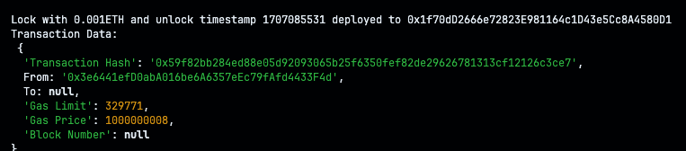
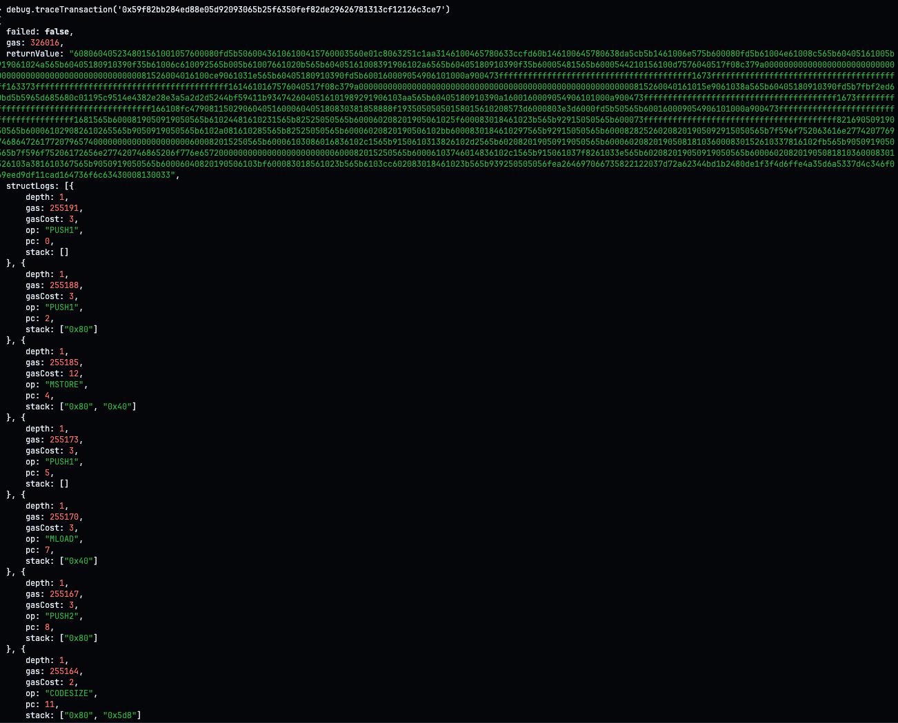

# Hardhat-PoA-Geth Integration

Creating and connecting a private Go-Ethereum network with Hardhat

## Nodes Information

- **Node chainId**
  - `19026` - bytes4(abi.encodePacked("JR"))
- **Node 1:**
  - Public key: 0x3E835c623Bb57926140B3f4C9d945A4d095e6995
  - Password: 123456
- **Node 2:**
  - Public key: 0x8A05cE0a845599beD82f13589aFc2F81Ea256Ebd
  - Password: 123456

## Steps to Set Up Nodes

1. Create directories for nodes:

   ```bash
   mkdir node1
   mkdir node2
   ```

2. Initialize Node 1:

   ```bash
   geth --datadir node1 account new
   geth init --datadir node1 genesis.json
   ```

3. Initialize Node 2:

   ```bash
   geth --datadir node2 account new
   geth init --datadir node2 genesis.json
   ```

4. Create and start Bootstrap Node:

   ```bash
   bootnode --genkey boot.key
   bootnode -nodekey boot.key -addr :30305
   ```

5. Start Node 1:

   ```bash
   geth --datadir node1 \
        --port 30306 \
        --bootnodes 'enode://86350457e8966ac7c80802d8b1a1dccb06b22136ff7f416c3a6ccc4947d9baa2503011dc7e74735e23d560fd50c15dada85d2a378649947dcde17abc020afd8e@127.0.0.1:0?discport=30305' \
        --networkid 123454321 \
        --unlock 0x3e6441efd0aba016be6a6357eec79fafd4433f4d \
        --password node1/password.txt \
        --authrpc.port 8551 \
        --mine \
        --miner.etherbase 0x3e6441efd0aba016be6a6357eec79fafd4433f4d \
        --http \
        --http.api 'web3,eth,net,debug,personal' \
        --http.corsdomain '*' \
        --allow-insecure-unlock \
        --http.port 30306
   ```

6. Start Node 2:

   ```bash
   cd ../node2
   geth --datadir node2 \
        --port 30307 \
        --bootnodes 'enode://86350457e8966ac7c80802d8b1a1dccb06b22136ff7f416c3a6ccc4947d9baa2503011dc7e74735e23d560fd50c15dada85d2a378649947dcde17abc020afd8e@127.0.0.1:0?discport=30305' \
        --networkid 123454321 \
        --unlock 0x45750942b281a91226b2f7781eca133caf6a592b \
        --password node2/password.txt \
        --authrpc.port 8552
   ```

7. Connect to Node 1 (start Geth JS console):

   ```bash
   # On a new terminal run
   geth attach node1/data/geth.ipc
   ```

8. Interact with Nodes:

   ```javascript
   // Send transaction from Node 1 to Node 2
   eth.sendTransaction({
     to: "0x45750942b281a91226b2f7781eca133caf6a592b",
     from: eth.accounts[0],
     value: 25000,
   });

   // Check balance of Node 2
   eth.getBalance("0x45750942b281a91226b2f7781eca133caf6a592b");
   ```

## Scheduling Hard Forks (Example)

1. Update `genesis.json`, e.g:

   ```json
   {
     "config": {
       "londonBlock": 4000
     }
   }
   ```

   `// a hard fork would occur to implement London fork upgrades once the node mines/validates up to block 4000`

2. Re-init (upgrade) nodes:
   ```bash
   geth init --datadir node1 genesis.json # You'd have to delete node1/geth folder before running this command if you changed the network ID in genesis.json.
   ```

## Connecting Local Private Node with Hardhat

This private node (node1) uses port `30306` which can be connected to Hardhat because of Geth's -http. I've configured Hardhat to work with the node just fine; you can find it in hardhat/hardhat.config.js:

```js
module.exports = {
  solidity: "0.8.19",
  networks: {
    localhost: {
      url: "http://127.0.0.1:30306", // Use the publicly local exposed port
      chainId: 19026,
    },
  },
};
```

After setting up the node with the previous commands stated above, we can just open a new terminal in the Harhat porject and run:

```bash
npx hardhat run scripts/deploy.js --network localhost
```

This should deploy the contract to the local private Geth node and return:



We can then trace the contract creation transaction with `debug.traceTransaction('your-transaction-hash')` in the Geth JavaScript console opened earlier:



The Geth JS console comes with the following objects (and sme others):

- eth: Interact with the Ethereum blockchain and smart contracts.
- web3: Access the Web3.js API for broader blockchain interactions.
- net: Manage network connections and peers.
- admin: Manage administrative tasks like node status and peers.
- debug: Access debugging tools and options.
- txpool: Query the transaction pool and manage pending transactions.
- miner: Control mining operations (if applicable).
- clique: Interact with the Clique Proof-of-Authority consensus engine.
